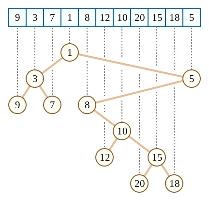

## 简介

RMQ 是英文 Range Maximum/Minimum Query 的缩写，表示区间最大（最小）值。

在笔者接下来的描述中，默认初始数组大小为 $n$ 。

在笔者接下来的描述中，默认时间复杂度标记方式为 $O($ 数据预处理 $)-O($ 单次询问 $)$ 。

## ST 表

由于 Oi wiki 中已有此部分的描述，本文仅给出 [链接](../ds/sparse-table.md) 。这部分不再展开。

时间复杂度 $O(n\log n)-O(1)$ 

空间复杂度 $O(n\log n)$ 

## 线段树

由于 Oi wiki 中已有此部分的描述，本文仅给出 [链接](../ds/seg.md) 。这部分不再展开。

时间复杂度 $O(n)-O(\log n)$ 

空间复杂度 $O(n\log n)$ 

## Four Russian

Four russian 是一个由四位俄罗斯籍的计算机科学家提出来的基于 ST 表的算法。

在 ST 表的基础上 Four russian 算法对其做出的改进是序列分块。

具体来说，我们将原数组——我们将其称之为数组 A——每 $S$ 个分成一块，总共 $n/S$ 块。

对于每一块我们预处理出来块内元素的最小值，建立一个长度为 $n/S$ 的数组 B，并对数组 B 采用 ST 表的方式预处理。

同时，我们对于数组 A 的每一个零散块也建立一个 ST 表。

询问的时候，我们可以将询问区间划分为不超过 1 个数组 B 上的连续块区间和不超过 2 个数组 A 上的整块内的连续区间。显然这些问题我们通过 ST 表上的区间查询解决。

在 $S=\log n$ 时候，预处理复杂度达到最优。为 $O((n / \log n)\log n+(n / \log n)\times\log n\times\log \log n)=O(n\log \log n)$ 

时间复杂度 $O(n\log \log n)-O(1)$ 

空间复杂度 $O(n\log \log n)$ 

当然询问由于要跑三个 ST 表，该实现方法的时间复杂度较大。

!!! note "一些小小的算法改进"
    我们发现，在询问的两个端点在数组 A 中属于不同的块的时候，数组 A 中块内的询问是关于每一块前缀或者后缀的询问。

    显然这些询问可以通过预处理答案在 $O(n)$ 的时间复杂度内被解决。

    这样子我们只需要在询问的时候进行至多一次 ST 表上的查询操作了。

## 笛卡尔树以及其构造

在实现更加优秀的时间复杂度之前，我们先来介绍一个数据结构：笛卡尔树。

笛卡尔树  (Cartesian tree) 的本质是一个二叉小根/大根堆。同时笛卡尔数满足对其中序遍历的结果等于原来的数组 A。

下面是一个笛卡尔树的具体例子：



接下来笔者将讲述一个构造笛卡尔树的 $O(n)$ 算法。

```text
新建一个大小为n的空栈。
For i:=1 to n
    flag = 0
    While 栈不为空
        if 栈顶元素<当前元素
            栈顶元素.右儿子=当前元素
            break
        else
            栈顶元素.右儿子=当前元素.左儿子。
            当前元素.左儿子=栈顶元素
            栈顶元素出栈
        当前元素入栈。
```

由于一个元素只会入栈一次，出栈一次，所以总复杂度为 $O(n)$ 。

## 笛卡尔树在 RMQ 上的应用

我们发现，原序列上两个点之间的 min/max，等于笛卡尔树上两个点的 LCA 的权值。

这也说明，我们现在需要去解决的是如何 $O(n)-O(1)$ 树上两个点之间的 LCA 的。

树上 LCA 在 [LCA](../graph/lca.md) 部分已经有描述，这里不再展开。

这里我们需要采用的是基于 RMQ 的树上 LCA 算法。

可能会有同学会问：为什么我们在绕了一圈之后，又回到了 RMQ 问题呢？

别着急，我们来找一找这个 RMQ 问题的特殊性质：

因为树的 dfs 序列的相邻两个节点互为父子关系，也就是说相邻两个节点深度差为 $\pm 1$ 。我们一般称这种相邻两个元素差为 1 的 RMQ 问题为 $\pm 1$ RMQ 问题。

根据这个特性我们就可以改进 Four Russian 算法了。

由于 Four russian 算法的瓶颈在于块内 RMQ 问题，我们重点去讨论块内 RMQ 问题的优化。

由于相邻两个数字的差值为 $\pm 1$ ，所以在固定左端点数字时 长度不超过 $\log n$ 的右侧序列种类数为 $\sum_{i=1}^{i \leq \log n} 2^{i-1}$ ，而这个式子显然不超过 $n$ 。

这启示我们可以预处理所有不超过 $n$ 种情况的 最小值 - 第一个元素 的值。

在预处理的时候我们需要去预处理同一块内相邻两个数字之间的差，并且使用二进制将其表示出来。

在询问的时候我们找到询问区间对应的二进制表示，查表得出答案。

这样子 Four russian 预处理的时间复杂度就被优化到了 $O(n)$ 。

结合笛卡尔树部分我们就可以实现 $O(n)-O(1)$ 的 RMQ 问题了。

代码和例题由于在 LCA 部分已经给出 [链接](../graph/lca.md) ，这里不再赘述。

当然由于转化步数较多， $O(n)-O(1)$ RMQ 跑的比较慢。
